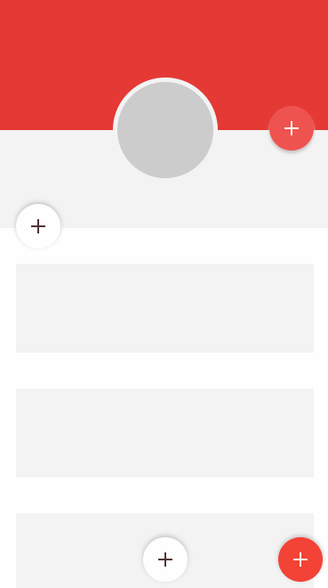

#  Collection of fuse tools fab components

Component | Input Properties | Description 
---------: | :----------------: | :----------- 
`<fab.standard />` | BtnBackground | Main fab button background color 
                   | IconColor  | Main fab button icon color 
                   | ItemsBackground | Background color of the sub items 
                   | ItemsIconColor | Colors for sub item icons 
`<fab.toolbar />`  | ToolbarColorr | Background color ( this will be for the button and the toolbar that becomes visible) 
                   | IconColor | Color for the main icon button 
                   | ItemsIconColor | Background color of toolbar icons 
`<fab.fullScreen />` | ScreenBackground | Background color ( this will be for the button and the screen that becomes visible) 
                   | BtnBackground | Main fab button background color 
                   | IconColor | Background color of toolbar icons 
`<fab.sheet />`    | SheetBackground | Background color ( this will be for the button and the sheet that becomes visible) 
                   | BtnBackground | Main fab button background color 
                   | IconColor  | Main fab button icon color 

#### Note: ( for fab.standard and fab.toolbar )
The sub items in the fab.standard and fab.toolbar have to be manually added. Each component has its own sub component  `*.*item.ux`. The item can be added like so

```
<!-- For Standard Button -->
<fab.fabItem ux:Name="fabItem1" FabIcon="&#xe877;" Color="{ReadProperty wrapper.ItemsBackground}"/>

<!-- For Toolbar -->
<fab.toolbarItem ux:Name="fabItem1" FabIcon="&#xe877;" IconColor="{ReadProperty wrapper.IconColor}" />
```

Note that the `ux:Name` is referenced in the animations, and therefor ( for now ) additional animations need to be added or deleted based on the number of sub items that you have.



- [x] Fix bringToFront
- [ ] Fix fullscreen icon
- [ ] Fix alignment issues


If you want to use or modify the components you can just download the component from the `components` folder and add it to you [fuse tools](https://www.fusetools.com/) project.
